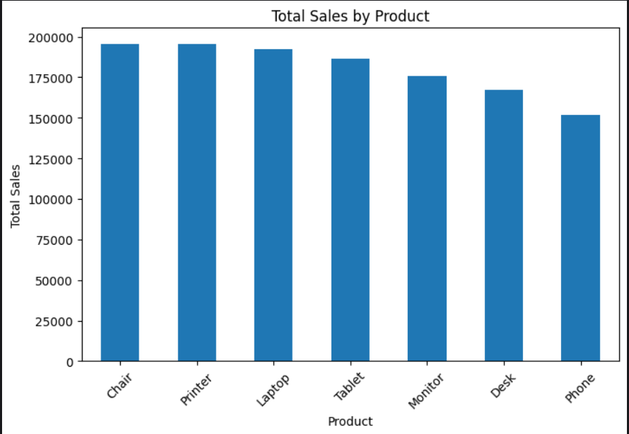
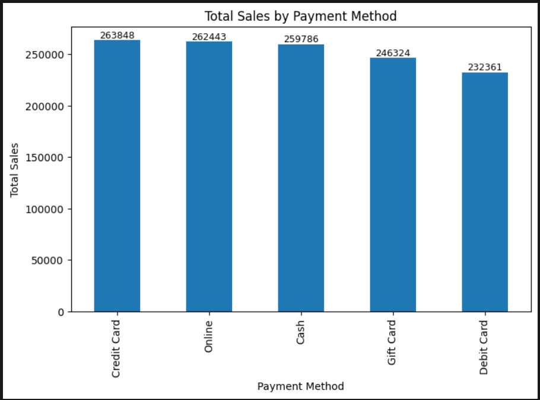
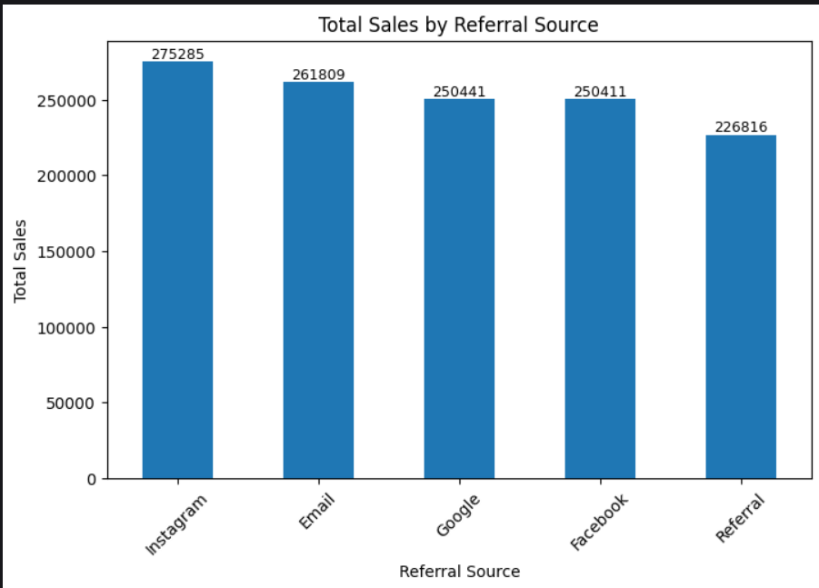
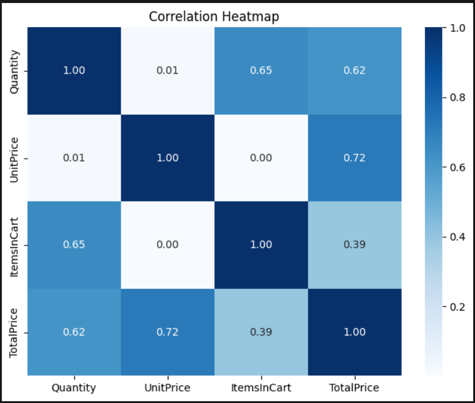

# 📊 Exploratory Data Analysis (EDA) on E-commerce Sales Dataset

## 📌 Project Overview

This project focuses on performing Exploratory Data Analysis (EDA) on an E-commerce Sales dataset using Python. The objective is to understand customer purchasing behavior, product performance, sales trends, payment preferences, referral sources, and relationships between key variables through statistical analysis and data visualization.

---

## 🎯 Objectives

- Understand the structure of the dataset
- Clean and preprocess the data
- Handle missing values
- Perform univariate and bivariate analysis
- Detect outliers
- Analyze correlations between numerical variables
- Generate business insights and recommendations

---

## 📂 Dataset Information

The dataset contains **1,200 records** and **14 columns**, including:

- Order ID
- Date
- Customer ID
- Product
- Quantity
- Unit Price
- Shipping Address
- Payment Method
- Order Status
- Tracking Number
- Items in Cart
- Coupon Code
- Referral Source
- Total Price

---

## 🛠️ Tools & Technologies

- Python
- Pandas
- NumPy
- Matplotlib
- Seaborn
- Jupyter Notebook

---

## 📈 Project Workflow

- Import Libraries
- Load Dataset
- Dataset Overview
- Data Cleaning
- Univariate Analysis
- Bivariate Analysis
- Correlation Analysis
- Key Findings
- Business Recommendations
- Conclusion

---
## 📸 Project Visualizations

### 📈 Product-wise Total Sales

This visualization compares the total sales generated by each product category.



---

### 💳 Payment Method Analysis

This chart shows the total sales generated through different payment methods.



---

### 🌐 Referral Source Analysis

This visualization highlights which referral sources contributed the most to overall sales.



---

### 🔥 Correlation Heatmap

The heatmap illustrates the relationships between numerical variables such as Quantity, Unit Price, Items in Cart, and Total Price.




## 📊 Key Findings

- Chair generated the highest total sales among all products.
- Phone recorded the lowest total sales.
- Credit Card was the highest revenue-generating payment method.
- Instagram contributed the highest sales among referral sources.
- Quantity, Unit Price, and Items in Cart showed no significant outliers.
- Total Price contained a few high-value outliers representing premium or bulk purchases.
- Quantity showed a positive relationship with Total Price.
- Unit Price had the strongest positive correlation (0.72) with Total Price.
- Quantity and Items in Cart showed a moderate positive correlation (0.65).

---

## 💼 Business Recommendations

- Focus promotional campaigns on high-performing products such as Chair, Printer, and Laptop.
- Continue investing in Credit Card and Online payment options to enhance customer convenience.
- Strengthen Instagram and Email marketing campaigns.
- Investigate high-value cancelled orders to reduce potential revenue loss.
- Improve the referral program through incentives and promotional offers.
- Introduce bundle offers and cross-selling strategies to increase average order value.

---

## 📚 Skills Demonstrated

- Exploratory Data Analysis (EDA)
- Data Cleaning
- Missing Value Handling
- Data Visualization
- Statistical Analysis
- Correlation Analysis
- Business Insight Generation
- Python Programming

---

## 📁 Repository Structure

```
Ecommerce-Sales-EDA/
│
├── EDA_Project.ipynb
├── Dataset for Data Analytics p2.csv
└── README.md
```

---

## 🚀 Outcome

This project demonstrates practical data analysis skills by transforming raw sales data into meaningful insights that can support business decision-making. The analysis highlights customer behavior, product performance, payment preferences, and marketing effectiveness using Python-based EDA techniques.

---

## 👩‍💻 Author

**Vennam Lakshmi Srinija**

Aspiring Data Analyst | Python | SQL | Excel | Power BI | Data Visualization
